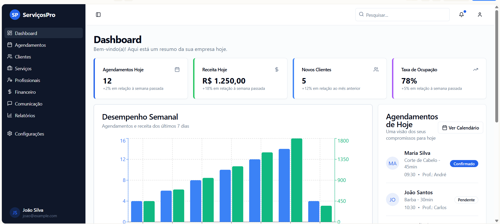
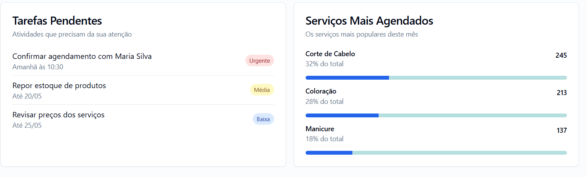

# SuperServiceSaaS

Bem-vindo ao **SuperServiceSaaS**, uma plataforma SaaS para gestão de prestação de serviços, ideal para pequenas e médias empresas como lava jatos, oficinas mecânicas e salões de beleza. Este projeto é educacional e colaborativo, aberto a contribuições!




## Sumário

1. [Sobre o Projeto](#sobre-o-projeto)
2. [Funcionalidades](#funcionalidades)
3. [Como Começar](#como-começar)
4. [Contribuição](#contribuição)
5. [Tecnologias](#tecnologias)
6. [Estrutura do Repositório](#estrutura-do-repositório)
7. [Documentação](#documentação)
8. [Licença](#licença)

## Sobre o Projeto

O **SuperServiceSaaS** é um sistema SaaS que oferece agendamento, controle de pagamentos, cadastro de serviços, integração com WhatsApp e customização por templates. Ele é projetado para ser escalável, acessível via internet e adaptável a diferentes segmentos de negócios.




### Objetivos
- Simplificar a gestão de serviços com uma interface intuitiva.
- Oferecer templates personalizáveis para diversos setores.
- Garantir escalabilidade e segurança com uma arquitetura moderna.

## Funcionalidades

- **Agendamento**: Calendário interativo, notificações e cancelamentos.
- **Pagamentos**: Integração com gateways, relatórios financeiros.
- **Serviços**: Cadastro e categorização de serviços.
- **Integração WhatsApp**: Confirmações, lembretes e campanhas.
- **Templates**: Personalização para lava jatos, oficinas, salões, etc.
- **Gestão de Clientes e Profissionais**: Histórico, fidelidade e comissões.
- **Relatórios**: Dashboards com indicadores e exportação de dados.

## Como Começar

### Pré-requisitos
- Node.js v16+
- PostgreSQL
- MongoDB
- Conta WhatsApp Business API
- Conta em um gateway de pagamento (ex.: Stripe)

### Clonando o Repositório
1. Faça o fork do repositório: [SuperServiceSaaS](https://github.com/Wendersonjose/SuperServiceSaaS).
2. Clone o fork:
   ```bash
   git clone https://github.com/seu-usuario/SuperServiceSaaS.git
   cd SuperServiceSaaS
   ```
3. Instale as dependências:
   ```bash
   npm install
   ```
4. Configure as variáveis de ambiente (exemplo em `.env.example`).
5. Inicie o projeto:
   ```bash
   npm start
   ```

## Contribuição

Quer ajudar a melhorar o projeto? Siga os passos abaixo:

1. Faça um fork do repositório.
2. Crie uma branch para sua feature:
   ```bash
   git checkout -b minha-feature
   ```
3. Faça o commit das suas alterações:
   ```bash
   git commit -m 'Minha nova feature'
   ```
4. Faça o push para a branch:
   ```bash
   git push origin minha-feature
   ```
5. Abra um Pull Request.

Por favor, leia nosso [Guia de Contribuição](CONTRIBUTING.md) para mais detalhes.

## Tecnologias

- **Frontend**: React.js, Material UI
- **Backend**: Node.js, Express/NestJS
- **Bancos de Dados**: PostgreSQL, MongoDB
- **Infraestrutura**: Docker, Kubernetes
- **Integrações**: WhatsApp Business API, Stripe/PayPal
- **Autenticação**: JWT, OAuth 2.0

## Estrutura do Repositório

```
SuperServiceSaaS/
├── assets/                # Imagens e recursos visuais
├── src/                   # Código-fonte
│   ├── frontend/          # Aplicação React
│   ├── backend/           # Microserviços Node.js
│   └── database/          # Scripts de banco de dados
├── docs/                  # Documentação detalhada
└── README.md              # Este arquivo
```

## Documentação

Para mais detalhes, consulte:
- [Especificação Completa](docs/especificacao.md)
- [Diagramas UML](docs/diagramas-uml.md)
- [Design de Interfaces](docs/design-interfaces.md)
- [Arquitetura do Sistema](docs/arquitetura.md)


## Licença

Este projeto está licenciado sob a [MIT License](LICENSE).

---

⭐ Se achou o projeto útil, deixe uma estrela no repositório!
