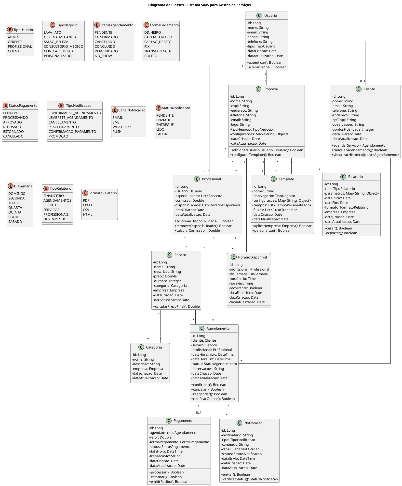

# Projeto de Software SaaS para Gestão de Prestação de Serviços

## Sumário

1. [Introdução](#introdução)
2. [Requisitos do Sistema](#requisitos-do-sistema)
3. [Escopo do Projeto](#escopo-do-projeto)
4. [Diagramas UML](#diagramas-uml)
   - [Diagrama de Casos de Uso](#diagrama-de-casos-de-uso)
   - [Diagrama de Classes](#diagrama-de-classes)
   - [Diagrama de Sequência - Agendamento](#diagrama-de-sequência---agendamento)
   - [Diagrama de Componentes](#diagrama-de-componentes)
   - [Diagrama de Implantação](#diagrama-de-implantação)
   - [Diagrama de Estado - Agendamento](#diagrama-de-estado---agendamento)
   - [Diagrama de Atividades - Pagamento](#diagrama-de-atividades---pagamento)
   - [Modelo de Banco de Dados](#modelo-de-banco-de-dados)
   - [Mapa do Site](#mapa-do-site)
5. [Design de Interfaces](#design-de-interfaces)
6. [Arquitetura do Sistema](#arquitetura-do-sistema)
7. [Estratégia de Implementação](#estratégia-de-implementação)
8. [Considerações Finais](#considerações-finais)

## Introdução

Este documento apresenta o projeto completo de um sistema SaaS (Software as a Service) para gestão de prestação de serviços, com foco em empresas que necessitam de agendamento, controle de pagamentos, cadastro de serviços, integração com WhatsApp e customização por templates conforme o tipo de negócio (lava jato, oficina mecânica, salão de beleza, entre outros).

O sistema foi projetado para atender às necessidades específicas de pequenas e médias empresas de prestação de serviços, oferecendo uma solução completa, customizável e escalável que pode ser adaptada a diferentes segmentos de mercado através de templates específicos.

A abordagem SaaS permite que os usuários acessem o sistema via internet, sem necessidade de instalação local, com pagamento baseado em assinatura, reduzindo custos iniciais e facilitando a adoção por empresas de diferentes portes.

## Requisitos do Sistema

### Requisitos Funcionais

#### Sistema de Agendamento

- Agendamento de serviços com data e hora
- Visualização de agenda por dia, semana e mês
- Bloqueio de horários indisponíveis
- Notificações de agendamentos
- Cancelamento e reagendamento de serviços

#### Controle de Pagamentos

- Registro de pagamentos
- Integração com gateways de pagamento
- Emissão de recibos e notas fiscais
- Controle de contas a receber
- Relatórios financeiros

#### Cadastro de Serviços

- Cadastro de serviços oferecidos
- Definição de preços e duração
- Categorização de serviços
- Associação de serviços a profissionais
- Personalização de serviços por tipo de negócio

#### Integração com WhatsApp

- Envio de confirmações de agendamento
- Lembretes de compromissos
- Notificações de pagamentos
- Comunicação direta com clientes
- Campanhas de marketing

#### Sistema de Templates

- Templates específicos para diferentes tipos de negócios:
  - Lava jato
  - Oficina mecânica
  - Salão de beleza
  - Outros tipos a serem definidos
- Personalização de interfaces
- Configuração de fluxos de trabalho específicos
- Adaptação de relatórios e métricas

#### Gestão de Clientes

- Cadastro de clientes
- Histórico de serviços
- Preferências e observações
- Segmentação de clientes
- Programa de fidelidade

#### Gestão de Profissionais

- Cadastro de profissionais/prestadores
- Definição de horários de trabalho
- Controle de comissões
- Avaliação de desempenho
- Agenda individual

#### Relatórios e Análises

- Dashboard com indicadores principais
- Relatórios de vendas
- Análise de desempenho
- Estatísticas de agendamentos
- Relatórios personalizados

### Requisitos Não Funcionais

#### Usabilidade

- Interface intuitiva e responsiva
- Adaptação para dispositivos móveis
- Tempo de resposta rápido
- Facilidade de aprendizado

#### Segurança

- Autenticação e autorização
- Criptografia de dados sensíveis
- Backup automático
- Conformidade com LGPD

#### Escalabilidade

- Suporte a múltiplos usuários simultâneos
- Capacidade de crescimento
- Balanceamento de carga

#### Disponibilidade

- Disponibilidade 24/7
- Tempo de inatividade mínimo
- Recuperação de falhas

#### Desempenho

- Tempo de resposta rápido
- Otimização de consultas ao banco de dados
- Carregamento eficiente de páginas

#### Integração

- APIs para integração com outros sistemas
- Webhooks para eventos
- Exportação e importação de dados

## Escopo do Projeto

### Objetivos do Projeto

- Desenvolver uma plataforma SaaS completa para gestão de prestação de serviços
- Criar um sistema customizável através de templates para diferentes segmentos de negócios
- Implementar funcionalidades essenciais de agendamento, pagamentos e comunicação
- Fornecer uma experiência de usuário intuitiva e responsiva
- Permitir escalabilidade e adaptação a diferentes volumes de negócios

### Público-Alvo

- Pequenas e médias empresas de prestação de serviços
- Profissionais autônomos que precisam gerenciar agendamentos e pagamentos
- Negócios específicos como lava jatos, oficinas mecânicas, salões de beleza, entre outros

### Componentes do Sistema

#### 1. Módulo de Autenticação e Gestão de Usuários

- Sistema de login e registro
- Gerenciamento de perfis e permissões
- Recuperação de senha e autenticação em dois fatores
- Painel administrativo para gestão de usuários

#### 2. Módulo de Agendamento

- Calendário interativo para visualização e marcação de compromissos
- Sistema de bloqueio de horários e verificação de disponibilidade
- Confirmação automática e lembretes de agendamentos
- Cancelamento e reagendamento com regras de negócio configuráveis

#### 3. Módulo de Cadastro e Gestão de Serviços

- Cadastro detalhado de serviços com preços, duração e recursos necessários
- Categorização e organização de serviços
- Vinculação de serviços a profissionais específicos
- Personalização de serviços por tipo de negócio

#### 4. Módulo de Gestão de Clientes

- Cadastro completo de clientes com informações de contato
- Histórico de serviços e pagamentos
- Preferências e observações específicas
- Sistema de fidelidade e pontuação

#### 5. Módulo de Pagamentos e Financeiro

- Integração com gateways de pagamento
- Controle de contas a receber
- Emissão de recibos e comprovantes
- Relatórios financeiros e fluxo de caixa

#### 6. Módulo de Comunicação e WhatsApp

- Integração com API do WhatsApp Business
- Envio automático de mensagens para confirmações e lembretes
- Templates de mensagens personalizáveis
- Histórico de comunicações

#### 7. Sistema de Templates e Customização

- Templates pré-configurados para diferentes tipos de negócios
- Personalização de interfaces e fluxos de trabalho
- Configuração de campos e atributos específicos por segmento
- Adaptação de relatórios e métricas relevantes

#### 8. Módulo de Relatórios e Analytics

- Dashboard com indicadores de desempenho
- Relatórios detalhados de vendas, agendamentos e clientes
- Gráficos e visualizações de dados
- Exportação de relatórios em diferentes formatos

#### 9. API e Integrações

- API RESTful para integração com sistemas externos
- Webhooks para notificações de eventos
- Integração com serviços de terceiros (calendários, sistemas de contabilidade)

### Limitações e Exclusões

- O sistema não incluirá funcionalidades de contabilidade completa
- Não será desenvolvido um aplicativo nativo para iOS/Android na primeira versão
- Não haverá integração com sistemas de ponto eletrônico ou controle de estoque completo
- O sistema não substituirá ERPs completos para gestão empresarial

### Tecnologias Propostas

- **Frontend**: React.js com Material UI para interfaces responsivas
- **Backend**: Node.js com Express ou NestJS
- **Banco de Dados**: PostgreSQL para dados relacionais, MongoDB para dados não estruturados
- **Autenticação**: JWT com OAuth 2.0
- **Infraestrutura**: Arquitetura em nuvem com Docker e Kubernetes
- **Comunicação**: Integração com WhatsApp Business API
- **Pagamentos**: Integração com gateways como Stripe, PayPal e locais

### Fases de Desenvolvimento

1. **Planejamento e Design**: Definição detalhada de requisitos, arquitetura e design de interfaces
2. **Desenvolvimento Core**: Implementação dos módulos principais (autenticação, agendamento, serviços)
3. **Desenvolvimento de Templates**: Criação de templates para diferentes segmentos de negócio
4. **Integrações**: Implementação de integrações com WhatsApp e gateways de pagamento
5. **Testes e Validação**: Testes unitários, de integração e validação com usuários
6. **Implantação**: Lançamento da versão inicial e configuração da infraestrutura
7. **Manutenção e Evolução**: Correções, melhorias e novas funcionalidades

## Diagramas UML

### Diagrama de Casos de Uso

O diagrama de casos de uso apresenta as principais funcionalidades do sistema e como os diferentes atores (Administrador, Prestador de Serviço, Cliente, Sistema de Pagamento e WhatsApp) interagem com essas funcionalidades.

### Diagrama de Classes

O diagrama de classes apresenta a estrutura estática do sistema, mostrando as principais classes, seus atributos, métodos e relacionamentos.

### Diagrama de Sequência - Agendamento

O diagrama de sequência ilustra o fluxo de interações entre os diferentes componentes do sistema durante o processo de agendamento de um serviço.

### Diagrama de Componentes

O diagrama de componentes mostra a organização e as dependências entre os diferentes componentes do sistema, incluindo frontend, backend, banco de dados e serviços externos.

### Diagrama de Implantação

O diagrama de implantação mostra a configuração física do sistema em termos de hardware, software e middleware, ilustrando como os componentes serão distribuídos na infraestrutura.

### Diagrama de Estado - Agendamento

O diagrama de estado mostra os diferentes estados pelos quais um agendamento pode passar durante seu ciclo de vida, desde a criação até a conclusão ou cancelamento.

### Diagrama de Atividades - Pagamento

O diagrama de atividades ilustra o fluxo de trabalho do processo de pagamento, mostrando as diferentes etapas e decisões envolvidas.

### Modelo de Banco de Dados

O modelo de banco de dados apresenta a estrutura das tabelas, seus campos e relacionamentos, fornecendo uma visão detalhada de como os dados serão armazenados no sistema.

### Mapa do Site

O mapa do site apresenta a estrutura de navegação do sistema, mostrando as principais páginas e suas relações hierárquicas.

## Design de Interfaces

### Princípios de Design

O design de interfaces do sistema seguirá os seguintes princípios:

1. **Responsividade**: Todas as interfaces serão responsivas, adaptando-se a diferentes tamanhos de tela e dispositivos.
2. **Consistência**: Elementos de interface, padrões de interação e terminologia serão consistentes em todo o sistema.
3. **Simplicidade**: Interfaces limpas e intuitivas, com foco nas tarefas principais de cada tela.
4. **Acessibilidade**: Conformidade com diretrizes de acessibilidade WCAG 2.1 nível AA.
5. **Customização**: Capacidade de adaptar a interface conforme o template do tipo de negócio.

### Principais Telas

#### Dashboard

O Dashboard será a tela principal após o login, apresentando:

- Visão geral dos indicadores de desempenho (agendamentos do dia, faturamento, etc.)
- Agenda do dia com próximos compromissos
- Notificações importantes
- Acesso rápido às principais funcionalidades

#### Calendário de Agendamentos

A tela de calendário permitirá:

- Visualização por dia, semana ou mês
- Código de cores para diferentes tipos de serviços ou status
- Funcionalidade de arrastar e soltar para reagendamentos
- Filtros por profissional, serviço ou cliente
- Botões de ação rápida para novo agendamento, cancelamento, etc.

#### Cadastro de Clientes

A tela de cadastro de clientes incluirá:

- Formulário com campos para informações pessoais e de contato
- Seção para preferências e observações
- Histórico de serviços realizados
- Histórico de pagamentos
- Indicadores de fidelidade

#### Gestão de Serviços

A interface de gestão de serviços apresentará:

- Lista de serviços com preços e duração
- Organização por categorias
- Opções para edição rápida
- Associação com profissionais
- Configurações específicas por tipo de negócio

#### Relatórios e Analytics

A seção de relatórios oferecerá:

- Dashboards interativos com gráficos e indicadores
- Filtros por período, serviço, profissional, etc.
- Opções de exportação em diferentes formatos
- Relatórios personalizados conforme o tipo de negócio

### Adaptação por Template

O sistema permitirá a customização da interface conforme o tipo de negócio:

- **Lava Jato**: Foco em serviços por veículo, com campos específicos para modelo, placa, etc.
- **Oficina Mecânica**: Ênfase em ordens de serviço, peças utilizadas e histórico do veículo.
- **Salão de Beleza**: Destaque para profissionais, portfólio de trabalhos e produtos utilizados.

Cada template adaptará:

- Terminologia específica do segmento
- Campos personalizados relevantes
- Fluxos de trabalho otimizados
- Relatórios e métricas específicas

## Arquitetura do Sistema

### Visão Geral da Arquitetura

O sistema será desenvolvido seguindo uma arquitetura de microserviços, com componentes independentes que se comunicam através de APIs bem definidas. Esta abordagem permite:

- Escalabilidade independente de cada componente
- Desenvolvimento e implantação contínuos
- Resiliência e isolamento de falhas
- Flexibilidade tecnológica

### Camadas da Arquitetura

#### 1. Camada de Apresentação

- **Frontend Web**: Aplicação React.js com Material UI
- **Frontend Mobile**: Interface responsiva web ou aplicativo híbrido (futuro)
- **API Gateway**: Ponto de entrada único para todas as requisições de clientes

#### 2. Camada de Microserviços

- **Serviço de Autenticação**: Gerenciamento de usuários, autenticação e autorização
- **Serviço de Agendamento**: Gestão de agendamentos, disponibilidade e calendário
- **Serviço de Clientes**: Cadastro e gestão de clientes
- **Serviço de Serviços**: Cadastro e gestão de serviços oferecidos
- **Serviço de Pagamentos**: Processamento e controle de pagamentos
- **Serviço de Notificações**: Envio de mensagens e notificações
- **Serviço de Templates**: Gerenciamento de templates e customizações
- **Serviço de Relatórios**: Geração de relatórios e analytics

#### 3. Camada de Dados

- **Banco Relacional**: PostgreSQL para dados estruturados (usuários, agendamentos, etc.)
- **Banco NoSQL**: MongoDB para dados não estruturados (configurações de templates, etc.)
- **Cache**: Redis para armazenamento em cache e melhoria de desempenho
- **Armazenamento de Objetos**: Para arquivos e mídias (S3 ou similar)

#### 4. Camada de Infraestrutura

- **Gerenciador de Filas**: RabbitMQ para comunicação assíncrona entre serviços
- **Serviço de Logs**: Elasticsearch + Kibana para centralização e análise de logs
- **Monitoramento**: Prometheus + Grafana para monitoramento e alertas
- **CI/CD**: Pipeline de integração e entrega contínuas

### Padrões Arquiteturais

- **API RESTful**: Para comunicação entre frontend e backend
- **Event Sourcing**: Para operações assíncronas e rastreabilidade
- **CQRS**: Separação de responsabilidades entre comandos e consultas
- **Circuit Breaker**: Para resiliência e tolerância a falhas
- **API Gateway**: Centralização de autenticação, roteamento e políticas

### Controle e Segurança

- **Autenticação**: JWT (JSON Web Tokens) com OAuth 2.0
- **Autorização**: Controle de acesso baseado em papéis (RBAC)
- **Criptografia**: HTTPS para todas as comunicações
- **Proteção de Dados**: Criptografia de dados sensíveis em repouso
- **Auditoria**: Registro de todas as ações críticas

## Estratégia de Implementação

### Fases do Desenvolvimento

#### Fase 1: Fundação (2-3 meses)

- Configuração da infraestrutura base
- Desenvolvimento do sistema de autenticação
- Implementação do módulo de agendamento básico
- Criação do cadastro de clientes e serviços
- Desenvolvimento da interface administrativa básica

#### Fase 2: Funcionalidades Core (3-4 meses)

- Implementação completa do sistema de agendamento
- Desenvolvimento do módulo de pagamentos
- Integração com WhatsApp para notificações básicas
- Implementação de relatórios essenciais
- Desenvolvimento do primeiro template (genérico)

#### Fase 3: Templates e Customização (2-3 meses)

- Desenvolvimento do sistema de templates
- Criação de templates específicos (lava jato, oficina, salão)
- Implementação de campos personalizados
- Adaptação de fluxos de trabalho por segmento
- Personalização de relatórios por tipo de negócio

#### Fase 4: Integrações e Aprimoramentos (2-3 meses)

- Integração completa com WhatsApp Business API
- Integração com múltiplos gateways de pagamento
- Implementação de funcionalidades avançadas de marketing
- Desenvolvimento de relatórios avançados e analytics
- Otimizações de desempenho e escalabilidade

### Metodologia de Desenvolvimento

O projeto será desenvolvido seguindo a metodologia Ágil Scrum:

- Sprints de 2 semanas
- Reuniões diárias de alinhamento
- Revisões de sprint com demonstrações
- Retrospectivas para melhoria contínua
- Backlog priorizado com base em valor de negócio

### Estratégia de Testes

- **Testes Unitários**: Para componentes individuais
- **Testes de Integração**: Para interações entre componentes
- **Testes de API**: Para validar endpoints e contratos
- **Testes de UI**: Para validar interfaces e experiência do usuário
- **Testes de Carga**: Para validar desempenho e escalabilidade
- **Testes de Segurança**: Para identificar vulnerabilidades

### Estratégia de Implantação

- **Ambiente de Desenvolvimento**: Para desenvolvimento contínuo
- **Ambiente de Teste**: Para validação de funcionalidades
- **Ambiente de Homologação**: Para validação pelo cliente
- **Ambiente de Produção**: Para uso final pelos usuários

A implantação será automatizada através de pipelines CI/CD, com:

- Integração contínua para validação de código
- Testes automatizados em cada ambiente
- Implantação contínua com possibilidade de rollback
- Monitoramento constante após implantações

## Considerações Finais

### Fatores Críticos de Sucesso

1. **Usabilidade**: Interface intuitiva e fácil de usar para diferentes perfis de usuários
2. **Desempenho**: Tempo de resposta rápido, especialmente em operações críticas como agendamento
3. **Customização**: Capacidade efetiva de adaptação a diferentes tipos de negócios
4. **Integração**: Funcionamento adequado com WhatsApp e gateways de pagamento
5. **Escalabilidade**: Capacidade de crescer conforme aumento da base de usuários

### Riscos e Mitigações

| Risco | Impacto | Probabilidade | Mitigação |
|-------|---------|--------------|-----------|
| Complexidade na customização por templates | Alto | Média | Arquitetura modular e testes extensivos com usuários reais |
| Problemas na integração com WhatsApp | Alto | Alta | Plano de contingência com SMS e outros canais alternativos |
| Desempenho inadequado com aumento de usuários | Alto | Média | Testes de carga antecipados e arquitetura escalável desde o início |
| Resistência de usuários à adoção | Médio | Média | Treinamento, suporte dedicado e foco em UX intuitiva |
| Mudanças nas APIs externas | Médio | Alta | Camadas de abstração e monitoramento constante de mudanças |

### Evolução Futura

O sistema foi projetado considerando possibilidades de evolução futura:

1. **Aplicativos Nativos**: Desenvolvimento de apps iOS e Android
2. **Inteligência Artificial**: Recomendações personalizadas e otimização de agenda
3. **Marketplace**: Plataforma para venda de produtos relacionados aos serviços
4. **Integração com IoT**: Para setores específicos como oficinas e clínicas
5. **Expansão Internacional**: Suporte a múltiplos idiomas e regulamentações

### Conclusão

O projeto de software SaaS para gestão de prestação de serviços apresentado neste documento foi concebido para atender às necessidades específicas de empresas que dependem de agendamento, controle de pagamentos e comunicação eficiente com clientes.

A abordagem baseada em templates permite que o sistema seja adaptado a diferentes segmentos de negócio, como lava jatos, oficinas mecânicas e salões de beleza, oferecendo uma solução completa e customizável.

A arquitetura moderna baseada em microserviços garante escalabilidade, resiliência e flexibilidade, permitindo que o sistema evolua conforme as necessidades do mercado e dos usuários.

Com foco em usabilidade, desempenho e integração, o sistema tem potencial para se tornar uma ferramenta essencial para empresas de prestação de serviços que buscam otimizar seus processos, melhorar a experiência do cliente e aumentar sua eficiência operacional.
